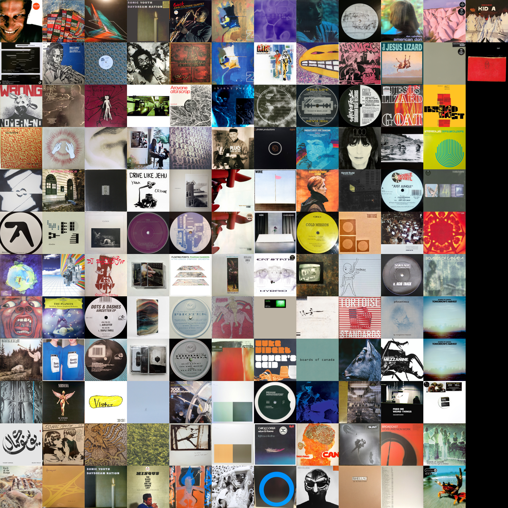

# Discogs Collage

A simple command line tool to create a collage image of the album art from your Discogs collection. 

Note: As of now, you must have a `DISCOGS_TOKEN` environment variable defined to receive images from Discogs API requests.

## Requirements

[Python Image Library](https://pillow.readthedocs.io/en/stable/) is used for image manipulation.

To install:
```
python3 -m pip install --upgrade pip
python3 -m pip install --upgrade Pillow
```

## Command Line Arguments

```
options:
  -h, --help            show this help message and exit
  -u USERNAME, --username USERNAME
                        The Discogs username to create a collage from.
  -sz SQUARE_SIZE, --square-size SQUARE_SIZE
                        The size of each square in the collage. Default is 200px.
  -so, --sort, --no-sort
                        Sort by artist in ascending order. Default is false.
```

## Example



